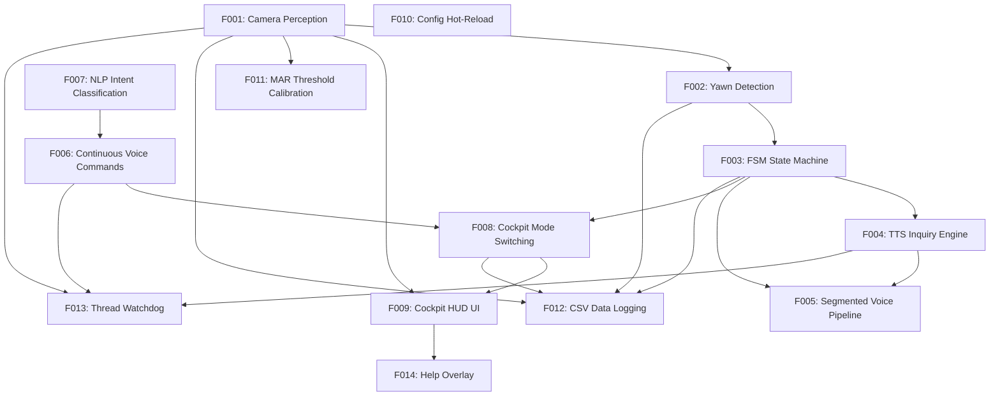

# DriveAware Inquire HCI v2 — Feature Map (v3)

## Features

### F001 — Camera Perception (Face Mesh + MAR)
- **Description**: CameraThread captures video, runs MediaPipe Face Landmarker, calculates 6-point Mouth Aspect Ratio per frame.
- **Dependencies**: None
- **Verification**: Camera preview visible in HUD, MAR value updates in real-time on screen, face status shows "Face: OK" when detected.
- **Status**: verified

### F002 — Yawn Detection (Exponential-Decay Scoring)
- **Description**: YawnDetector accumulates MAR evidence via exponential growth/decay model. Score >= 1.0 triggers yawn event with cooldown to prevent double-counting.
- **Dependencies**: F001
- **Verification**: Press Y to simulate yawn, yawn_count increments in SharedState, FSM advances from MONITORING to YAWN_DETECTED.
- **Status**: verified

### F003 — FSM State Machine
- **Description**: Finite state machine: MONITORING -> YAWN_DETECTED -> INQUIRING -> LISTENING -> CONFIRMING -> SWITCHING -> MONITORING, with retry and abandon logic.
- **Dependencies**: F002
- **Verification**: State transitions print to console, UI state_text updates. Y key triggers full cycle.
- **Status**: verified

### F004 — TTS Inquiry Engine
- **Description**: pyttsx3 offline TTS thread speaks inquiry/confirmation prompts from config.json at INQUIRING and CONFIRMING states.
- **Dependencies**: F003
- **Verification**: System speaks "You seem relaxed..." when yawn detected in Rest mode, speaks "Switching to Dynamic Mode" on confirmation.
- **Status**: verified

### F005 — Segmented Voice Recording Pipeline (FSM)
- **Description**: 4-second recording chunks up to 20 seconds for yawn-triggered voice capture. Stops on keyword hit via Whisper STT + NLP parser.
- **Dependencies**: F003, F004
- **Verification**: After TTS inquiry, system records audio and transcribes speech. Keyword match triggers CONFIRMING, silence/unknown triggers retry up to MAX_RETRIES.
- **Status**: verified

### F006 — Continuous Voice Commands (VAD-based)
- **Description**: VoiceListener thread with adaptive VAD noise floor continuously listens for "dynamic"/"rest" commands, bypassing the FSM entirely.
- **Dependencies**: F007
- **Verification**: Say "dynamic mode" or "rest mode" at any time, mode switches immediately with TTS confirmation.
- **Status**: verified

### F007 — NLP Intent Classification
- **Description**: Keyword matching first (fast, handles ~90% of commands), DeepSeek API as fallback for ambiguous phrases. Classifies as "dynamic", "rest", or "unknown".
- **Dependencies**: None
- **Verification**: Transcript "yes" -> "dynamic", "no" -> "rest". Ambiguous phrases hit DeepSeek API fallback. Works without API key using keywords only.
- **Status**: verified

### F008 — Cockpit Mode Switching
- **Description**: Two cockpit modes (Dynamic: warm orange/18C/high fan vs Rest: cool blue/26C/low fan) with smooth ambient color transitions and music switching.
- **Dependencies**: F003, F006
- **Verification**: Press 1/2 or voice command, ambient color transitions smoothly, music changes, climate display updates in UI.
- **Status**: verified

### F009 — Cockpit HUD UI
- **Description**: Pygame window rendering mode name, ambient color label, climate display, camera preview with MAR/threshold overlay, face status, mic level meter, and hint bar.
- **Dependencies**: F001, F008
- **Verification**: All UI elements render, camera preview visible, MAR value updates in real-time, mode info matches current mode.
- **Status**: verified

### F010 — Config Hot-Reload
- **Description**: config.py with PEP 562 __getattr__ exposes config.json keys as module attributes. Press F5 to reload at runtime without restarting.
- **Dependencies**: None
- **Verification**: Edit a value in config.json, press F5, console confirms reload, new value takes effect.
- **Status**: verified

### F011 — MAR Threshold Calibration
- **Description**: 30-second per-session calibration: 10s neutral face for baseline MAR, 10s yawn for peak MAR. Threshold = baseline + 0.6*(peak - baseline). Saved to config.json.
- **Dependencies**: F001
- **Verification**: Press C, follow on-screen prompts, new threshold displayed and saved to config.json.
- **Status**: verified

### F012 — CSV Data Logging
- **Description**: Toggle with D key. Logs timestamp, MAR, yawn_count, active_mode, system_state to logs/session_*.csv for offline analysis.
- **Dependencies**: F001, F002, F003, F008
- **Verification**: Press D, CSV file created in logs/, data rows stream in real-time.
- **Status**: verified

### F013 — Thread Watchdog
- **Description**: Monitors camera, TTS, and listener thread health every 30 frames. Auto-restarts crashed threads up to 3 times.
- **Dependencies**: F001, F004, F006
- **Verification**: Crashed thread triggers restart message, recovers; after 3 failures gives up.
- **Status**: verified

### F014 — Help Overlay
- **Description**: Semi-transparent overlay listing all keyboard shortcuts. Toggle with H key.
- **Dependencies**: F009
- **Verification**: Press H shows shortcuts, press H again hides overlay.
- **Status**: verified

## Dependency Graph

