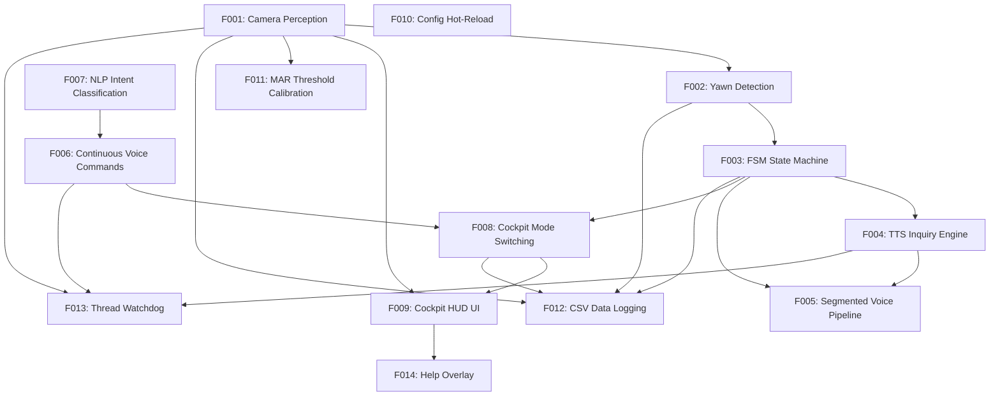

# DriveAware Inquire HCI v2 — Technical Report (v3)

## Abstract

DriveAware Inquire HCI v2 is a driver fatigue monitoring research prototype built on an **inquiry-based HCI paradigm**: the system perceives driver state via camera (face mesh → MAR → yawn detection), inquires via TTS whether to switch cockpit mode, the driver decides via voice response, and the cockpit adapts (ambient light, music, UI overlay). The core proposition is *system perceives + suggests, human decides* — preserving driver agency. All 14 core features are verified. The current v3 iteration replaces local Whisper STT with Baidu Cloud ASR API (zero local model), and the next planned milestone is multi-modal fatigue perception (EAR + head pose fusion).

## 1. Introduction

### Problem Statement

Driver fatigue is a leading cause of traffic accidents. Existing fatigue monitoring systems either (a) passively alert without interaction, reducing driver agency, or (b) fully automate mode switching, which drivers may distrust. This project proposes a middle ground: an **inquiry-based HCI system** where the car monitors fatigue signals, *asks* the driver whether to switch modes, and the driver retains the final decision authority.

### System Goal

Build a desktop prototype that demonstrates the inquiry-based interaction loop: camera perception → fatigue inference → TTS inquiry → voice response → cockpit adaptation. The prototype serves as a research platform for future user studies on trust, agency, and non-intrusiveness.

### Tech Stack

Python + OpenCV + MediaPipe (Face Landmarker) + Baidu Cloud ASR API + pyttsx3 (TTS) + Pygame (UI) + DeepSeek API (NLP fallback)

## 2. Architecture

### Directory Layout

```
project/
├── main.py                     — Entry point: wires threads, starts CockpitApp
├── config.py + config.json     — Hot-reloadable runtime configuration
├── src/
│   ├── core/                   — SharedState, CockpitMode, FSM state machine
│   ├── perception/             — Camera, Face Mesh, MAR, YawnDetector, Calibration
│   ├── interaction/            — TTS, Baidu STT, VoiceListener, NLP Parser, AudioRecorder
│   ├── execution/              — Pygame main loop (CockpitApp) + HUD renderer (CockpitUI)
│   └── utils/                  — Audio resampling, CSV data logger
├── tests/                      — Pytest unit tests (5 test files)
├── assets/                     — MediaPipe model, sounds, images
└── v3/                         — Plan, Flow, Tasks, Changelog, Paper, Project Structure
```

### Thread Model

- **CameraThread** — OpenCV capture → face mesh → MAR → yawn scoring
- **TTSEngine** (thread) — Queue-driven offline TTS (pyttsx3)
- **VoiceListener** (daemon) — Continuous VAD-based voice command detection
- **FSM voice pipeline** (daemon workers) — Segmented recording + Baidu ASR + NLP parsing

All threads synchronize through `SharedState` with a `threading.Lock`.

### State Machine (Core Interaction Loop)

```
MONITORING → YAWN_DETECTED → INQUIRING → LISTENING → CONFIRMING → SWITCHING → MONITORING
                                 ↑                        │
                                 └── retry (max 3x) ──────┘
```

- **MONITORING**: Camera scores MAR per frame. 2+ yawns trigger YAWN_DETECTED.
- **INQUIRING**: TTS asks driver whether to switch mode.
- **LISTENING**: 4s recording chunks (max 20s). Keyword match → CONFIRMING. Silence/unknown → retry.
- **CONFIRMING → SWITCHING**: TTS confirms, cockpit transitions mode.
- **Voice commands** ("dynamic"/"rest") bypass the FSM entirely via continuous VoiceListener.

## 3. Features

All 14 features verified via manual testing against flow.yaml verification criteria.

| ID | Feature | Status |
|----|---------|--------|
| F001 | Camera Perception (Face Mesh + MAR) | verified |
| F002 | Yawn Detection (Exponential-Decay Scoring) | verified |
| F003 | FSM State Machine (6 states + retry/abandon) | verified |
| F004 | TTS Inquiry Engine (pyttsx3, offline, Chinese) | verified |
| F005 | Segmented Voice Recording Pipeline (FSM-triggered) | verified |
| F006 | Continuous Voice Commands (VAD-based, bypasses FSM) | verified |
| F007 | NLP Intent Classification (keyword + DeepSeek API fallback) | verified |
| F008 | Cockpit Mode Switching (Dynamic/Rest with smooth transitions) | verified |
| F009 | Cockpit HUD UI (Pygame: camera preview, MAR, mic level, mode info) | verified |
| F010 | Config Hot-Reload (PEP 562 bridge, F5 key) | verified |
| F011 | MAR Threshold Calibration (30s 2-phase per-session) | verified |
| F012 | CSV Data Logging (D key toggle, logs/ session files) | verified |
| F013 | Thread Watchdog (30-frame health check, 3x auto-restart) | verified |
| F014 | Help Overlay (semi-transparent, H key toggle) | verified |

### Cockpit Modes

| Mode | Ambient | Music | AC Temp | Fan | UI Overlay |
|------|---------|-------|---------|-----|------------|
| Dynamic | Warm Orange | dynamic_rhythm.wav | 18°C | High | dynamic_overlay.png |
| Rest | Cool Blue | rest_soothing.wav | 26°C | Low | rest_overlay.png |

### Unit Tests

| Test File | Covers |
|-----------|--------|
| `test_mar.py` | MAR 6-point calculation correctness |
| `test_yawn_detector.py` | Exponential growth/decay scoring, cooldown logic |
| `test_state_machine.py` | FSM state transitions, retry, abandon |
| `test_nlp_parser.py` | Keyword matching, DeepSeek API fallback |
| `test_shared_state.py` | Thread-safe field access, atomic operations |

## 4. Version History

### v2 (sealed 2026-05-15) — Baseline

- All 14 core features implemented and verified
- Code quality improvements: dedup `_enter_rest_mode()`, extract `resample_to_16khz()`, simplify watchdog, initialize `_inquiry_tts_start`
- Known issues carried forward: Whisper `small` hallucination, camera thread restart limitations, mic device contention

### v3 (current, 2026-05-16) — STT Migration

**B01 (Whisper Async Loading) — Skipped.** Cloud API eliminates local model loading entirely.

**B02 (STT Engine Upgrade) — Resolved via Baidu ASR API.**
- `ctranslate2` segfault blocked the planned faster-whisper upgrade (all configs: tiny/medium, CPU/CUDA, int8/float32)
- Migrated to Baidu Cloud Short Voice Recognition API: HTTP POST + OAuth token, zero local model, 50k free calls/day
- `stt_engine.py` rewritten as Baidu ASR client with auto token refresh and WAV encoding
- Dependencies simplified: `openai-whisper` + `torch==2.6.0` → `requests>=2.28.0`
- Cleaned 1.5GB damaged HuggingFace cache + 2.2GB failed faster-whisper experiment
- Fixed language parameter (`dev_pid=1737` for English model)
- Removed Whisper-small misrecognition patches from `nlp_parser.py`

## 5. Current State

### Feature Completion: 14/14 (100%) ✅

### Architecture Backlog

| ID | Item | Priority | Status |
|----|------|----------|--------|
| B01 | Whisper Async Loading | 10 | Skipped |
| B02 | STT: Baidu ASR API Migration | 7 | **Done** |
| B03 | Multi-Modal Perception | 6 | Pending ← **next** |
| B04 | Event Bus Architecture | 9 | Pending (do last) |

### Known Issues

- Single-modality perception (MAR only) — no eye closure or head pose signal
- No real driving task, no steering wheel, no in-vehicle noise environment
- MAR threshold is per-session only (factory default restored on relaunch)
- Zero test coverage for `cockpit_app.py` and `cockpit_ui.py`
- VoiceListener and FSM voice_pipeline share mic device (potential contention on some audio drivers)

### Next Milestone: B03 Multi-Modal Perception

Add Eye Aspect Ratio (EAR) + head pose (pitch/yaw/roll) + weighted fatigue scorer fusion. This addresses the single-modality limitation and improves fatigue detection robustness under low-light and head-turn conditions.

### Academic Items (not started)

| ID | Task |
|----|------|
| P0-1 | User study (≥20 participants, trust/annoyance/control questionnaires) |
| P0-2 | A/B baseline (manual vs auto-switch vs inquiry-based) |
| P0-3 | Quantitative metrics (yawn precision/recall/F1, WER, end-to-end latency) |
| P0-4 | Discussion logic (inquiry cognitive cost, yawn-relaxation literature, 2-yawn threshold evidence) |

## Appendix: Feature Dependency Graph


