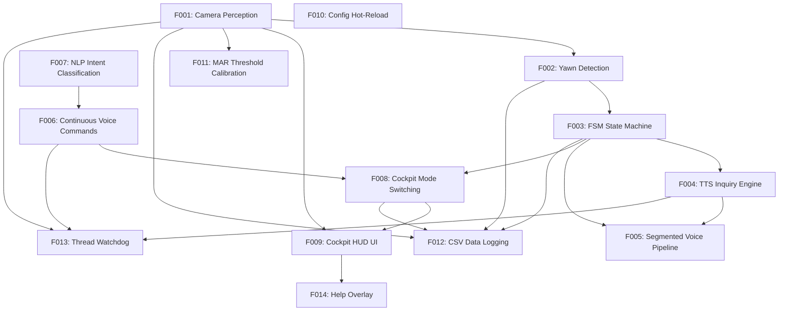

# DriveAware Inquire HCI v2 — Project Structure (v3)

**Generated**: 2026-05-16T19:00:00+08:00
**Source root**: `D:\MY_WORKS\WOERKSHOP\Claude_with\DriveAware_Inquire_HCI_v2`

## Directory Tree

```
project/
├── main.py                          — Entry point: wires threads, starts CockpitApp, loads Baidu STT + NLP
├── config.py                        — PEP 562 __getattr__ hot-reload adapter over config.json
├── config.json                      — All runtime parameters (camera, audio, VAD, TTS, colors, prompts)
├── requirements.txt                 — pip dependencies (no torch, no local STT model)
├── pytest.ini                       — Pytest configuration
├── .env.example                     — Template: DEEPSEEK_API_KEY, BAIDU_ASR_API_KEY, BAIDU_ASR_SECRET_KEY
├── CLAUDE.md                        — Claude Code project instructions
├── LICENSE                          — MIT license
├── README.md                        — Project overview (English)
├── README_CN.md                     — Project overview (Chinese)
├── src/
│   ├── core/
│   │   ├── shared_state.py          — Thread-safe SharedState dataclass + SystemState enum
│   │   ├── modes.py                 — CockpitMode dataclass (DYNAMIC_MODE / REST_MODE presets)
│   │   └── state_machine.py         — FSM: MONITORING→YAWN_DETECTED→INQUIRING→LISTENING→CONFIRMING→SWITCHING
│   ├── perception/
│   │   ├── camera.py                — CameraThread: OpenCV capture → face mesh → MAR → yawn scoring
│   │   ├── face_mesh.py             — MediaPipe Face Landmarker wrapper
│   │   ├── mar.py                   — Six-point Mouth Aspect Ratio calculator
│   │   ├── yawn_detector.py         — Exponential-decay yawn scoring (growth/decay model)
│   │   └── calibration.py           — Per-session MAR threshold calibration (press C)
│   ├── interaction/
│   │   ├── tts_engine.py            — pyttsx3 TTS thread (offline, Chinese voice)
│   │   ├── stt_engine.py            — Baidu Cloud ASR API (HTTP POST, OAuth token, WAV encoder)
│   │   ├── voice_listener.py        — Continuous VAD-based listener for "dynamic"/"rest" commands
│   │   ├── nlp_parser.py            — Intent classification: keyword matching first, DeepSeek API fallback
│   │   └── audio_recorder.py        — Mic auto-detection + segmented recording for FSM voice pipeline
│   ├── execution/
│   │   ├── cockpit_app.py           — Pygame main loop: FSM orchestration, watchdog, voice pipeline, mode switching
│   │   └── cockpit_ui.py            — Pygame HUD: state bar, MAR meter, mic level, camera preview, help overlay
│   └── utils/
│       ├── audio.py                 — Audio resampling utility (→ 16kHz mono int16)
│       └── data_logger.py           — CSV session logger for user studies (toggle with D)
├── tests/
│   ├── conftest.py                  — Pytest fixtures (SharedState, config patches)
│   ├── test_shared_state.py         — SharedState threading + field tests
│   ├── test_state_machine.py        — FSM transition tests
│   ├── test_yawn_detector.py        — YawnDetector scoring tests
│   ├── test_mar.py                  — MAR calculation tests
│   └── test_nlp_parser.py           — NLP keyword + API fallback tests
└── assets/
    ├── face_landmarker.task         — MediaPipe Face Landmarker model (~6MB)
    ├── sounds/
    │   ├── dynamic_rhythm.wav       — Dynamic mode ambient music
    │   ├── rest_soothing.wav        — Rest mode ambient music
    │   └── transition.wav           — Mode transition sound effect
    └── images/
        ├── dynamic_overlay.png      — Dynamic mode UI overlay
        └── rest_overlay.png         — Rest mode UI overlay
```

## Module → Feature Mapping

| Module/File | Feature ID | Feature Name |
|-------------|-----------|--------------|
| `src/perception/camera.py` | F001 | Camera Perception (Face Mesh + MAR) |
| `src/perception/face_mesh.py` | F001 | Camera Perception (Face Mesh + MAR) |
| `src/perception/mar.py` | F001 | Camera Perception (Face Mesh + MAR) |
| `src/perception/yawn_detector.py` | F002 | Yawn Detection (Exponential-Decay Scoring) |
| `src/core/state_machine.py` | F003 | FSM State Machine |
| `src/execution/cockpit_app.py` | F003, F008, F013 | FSM, Mode Switching, Thread Watchdog |
| `src/interaction/tts_engine.py` | F004 | TTS Inquiry Engine |
| `src/interaction/audio_recorder.py` | F005 | Segmented Voice Recording Pipeline |
| `src/interaction/stt_engine.py` | F005, F006 | Voice Pipeline, Continuous Commands |
| `src/interaction/voice_listener.py` | F006 | Continuous Voice Commands (VAD-based) |
| `src/interaction/nlp_parser.py` | F007 | NLP Intent Classification |
| `src/core/modes.py` | F008 | Cockpit Mode Switching |
| `src/execution/cockpit_ui.py` | F009, F014 | Cockpit HUD UI, Help Overlay |
| `config.py` + `config.json` | F010 | Config Hot-Reload |
| `src/perception/calibration.py` | F011 | MAR Threshold Calibration |
| `src/utils/data_logger.py` | F012 | CSV Data Logging |
| `src/utils/audio.py` | — | Shared utility (F005, F006) |
| `src/core/shared_state.py` | — | Shared infrastructure (all features) |
| `tests/test_mar.py` | F001 | Camera Perception |
| `tests/test_yawn_detector.py` | F002 | Yawn Detection |
| `tests/test_state_machine.py` | F003 | FSM State Machine |
| `tests/test_nlp_parser.py` | F007 | NLP Intent Classification |
| `tests/test_shared_state.py` | — | Shared infrastructure |

## Dependency Graph



## v3 Delta (vs v2)

| Change | Details |
|--------|---------|
| STT Engine | openai-whisper → Baidu Cloud ASR API (HTTP POST, zero local model) |
| Dependencies | Removed `torch`, `openai-whisper`; added `requests` |
| New file | `src/utils/audio.py` — shared resample_to_16kHz utility |
| Renamed field | `SharedState.whisper_ready` → `stt_ready` |
| Deleted | `models/` (2.2GB failed faster-whisper experiment), `requirements-lock.txt` (stale) |
| Config | Added `ASR_PROVIDER: "baidu"`, `dev_pid: 1737` (English model) |
| .env | Added `BAIDU_ASR_API_KEY`, `BAIDU_ASR_SECRET_KEY` |
